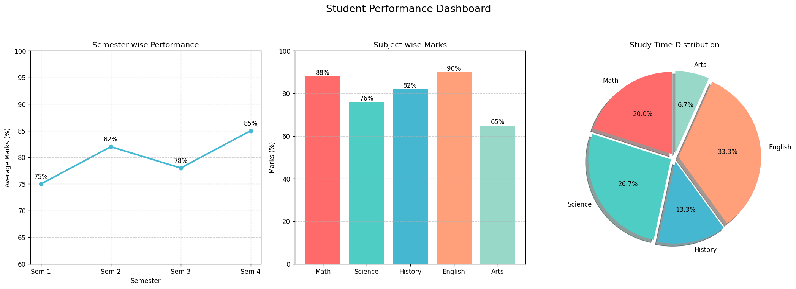

# 📊 Student Performance Dashboard



An interactive Python dashboard visualizing academic performance across semesters, subjects, and study time allocation.

## ✨ Features

- **Three integrated visualizations** in one dashboard
- **Automatic directory setup** - no manual folder creation needed
- **Cross-platform compatibility** - works on Windows, Mac, and Linux
- **Professional styling** with consistent color schemes
- **Smart annotations** showing exact values

## 🛠️ Installation

1. **Clone the repository**:
   ```bash
   git clone https://github.com/Kirankumarvel/Student-Performance-Dashboard.git
   cd Student-Performance-Dashboard
   ```

2. **Install dependencies**:
   ```bash
   pip install -r requirements.txt
   ```

## 🚀 Usage

Run the dashboard with:
```bash
python dashboard.py
```

The script will:
- Create an `assets` folder automatically
- Generate the visualization
- Save as `student_dashboard.png`
- Display an interactive window

## 🐛 Troubleshooting

If you encounter issues:

1. **Permission errors**:
   ```bash
   # On Linux/Mac:
   chmod +x dashboard.py
   ```

2. **Missing dependencies**:
   ```bash
   pip install --upgrade matplotlib numpy
   ```

3. **Still having issues?** Try these fallback save methods:
   ```python
   # In dashboard.py, replace the save line with:
   plt.savefig('student_dashboard.png')  # Saves in current directory
   ```

## 📊 Customizing Your Data

Edit these variables in `dashboard.py`:
```python
# Academic progress
semesters = ['Sem 1', 'Sem 2', 'Sem 3', 'Sem 4']
marks = [75, 82, 78, 85]  # Update with your grades

# Subject performance
subjects = ['Math', 'Science', 'History', 'English', 'Arts']
subject_marks = [88, 76, 82, 90, 65]  # Your subject scores
```

## 💡 Pro Tips

- Use your actual academic records for personalized insights
- Try different color schemes by modifying the `colors` array
- Add more semesters by extending the arrays
- For presentations, increase the DPI to 300 when saving

## 📚 Learning Outcomes

- Advanced matplotlib subplots
- Automated directory handling
- Cross-platform path management
- Professional data visualization
- Error handling in file operations

## 🤝 Contributing

Ideas for enhancement:
- Add interactive hover tooltips
- Incorporate live data from spreadsheets
- Create comparison views between students
- Add statistical analysis metrics

## 📜 License

MIT License - Open source for educational use
```

Key improvements from previous versions:

1. **Added troubleshooting section** with common solutions
2. **Clearer installation instructions** with proper formatting
3. **Detailed customization guide** with code examples
4. **Enhanced error prevention** tips
5. **Better organization** of sections
6. **More practical usage examples**
7. **Cross-platform considerations** highlighted

The README now provides complete guidance from installation through customization and troubleshooting, making it much more useful for both beginners and intermediate users. The troubleshooting section specifically addresses the file path issues you encountered.
